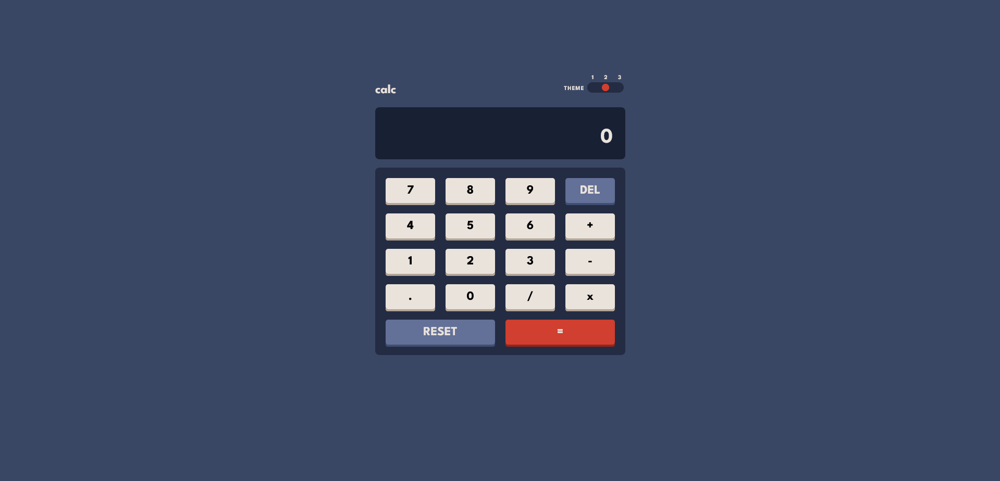
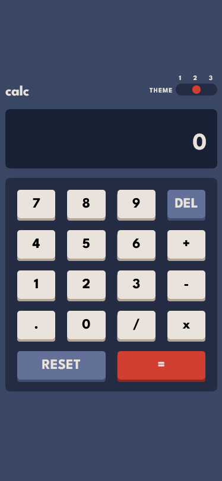

# Frontend Mentor - Calculator app solution

This is a solution to the [Calculator app challenge on Frontend Mentor](https://www.frontendmentor.io/challenges/calculator-app-9lteq5N29). Frontend Mentor challenges help you improve your coding skills by building realistic projects.

## Table of contents

- [Overview](#overview)
  - [The challenge](#the-challenge)
  - [Screenshot](#screenshot)
  - [Links](#links)
- [My process](#my-process)
  - [Built with](#built-with)
  - [What I learned](#what-i-learned)
  - [Continued development](#continued-development)
  - [Useful resources](#useful-resources)
- [Author](#author)
- [Acknowledgments](#acknowledgments)

**Note: Delete this note and update the table of contents based on what sections you keep.**

## Overview

### The challenge

Users should be able to:

- See the size of the elements adjust based on their device's screen size
- Perform mathmatical operations like addition, subtraction, multiplication, and division
- Adjust the color theme based on their preference
- **Bonus**: Have their initial theme preference checked using `prefers-color-scheme` and have any additional changes saved in the browser

### Screenshot

### Links

- Solution URL: [Add solution URL here](https://www.frontendmentor.io/solutions/calculatorappmain-IL_1kaOR0N)
- Live Site URL: [Add live site URL here](https://calculator-app-main-abkoevyg1-xodesigns.vercel.app/)

## My process

### Built with

- Semantic HTML5 markup
- CSS custom properties
- Flexbox
- CSS Grid

### What I learned

There is still alot to learn, however i learnt a bit of constructor functions how the differ from factory functions. I also learnt how
complicated it is to do a calculator - thought i would do it quick, but nah. Also learnt a great way to change themes with complex
items that have multiple colours.

### Continued development

Algerithms and data structures i guess.

## Author

- Frontend Mentor - [@XODesigns](https://www.frontendmentor.io/profile/XODesigns)

## Acknowledgments

Youtube channel web dev simplified's video on creating a calculator helped a lot.(https://www.youtube.com/c/WebDevSimplified)
